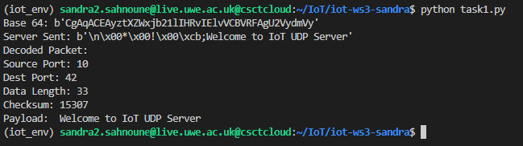
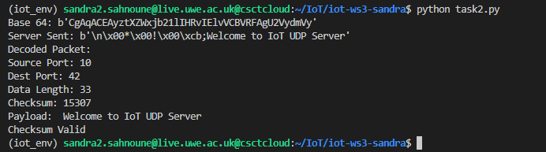
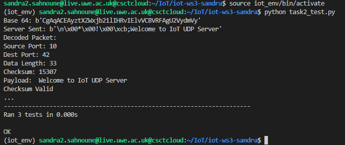
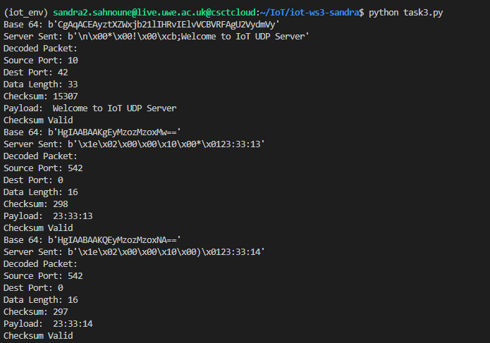

# iot-WS3-sandra

* NoTe :  IOT environment must be set up and used along this project in order to run the following tasks successfully.

## Task 1:

This task aims to implement a basic program which is able to receive messages from UWE remote server. It also decode the message from `Base64` into plaintext and split it into a readable foprmat for the user.

### How To Run The Code :
Compile python script `task1.py` in order to display the output of the packet. The IoT environment must also be set up using `source iot_env/bin/activate`.

---
## Task 2:
A `checksum()` function required to be constructed based on the software implemented in [Task 1](task1.py) to operate as a type of error checking for the packets. This program's new checksum comparison function computes the packet's checksum and compares it to the checksum contained within the packet itself. This is accomplished by converting the header data to binary, combining them with the payload, and then performing a bitwise NOT to obtain the one's complement. After that, the newly computed checksum is compared to the original checksum received with the packet. Depending on whether the checksum is valid or not, a message is displayed on the screen.
The results of the unit tests for [Task 2](task2.py) can be seen by running [Task2_test](task2_test.py).

Results of the implementation as follow:

Finally, the function `compute_checksum()` is verified using unittest:

---

## Task 3:
This task aims to add a functionality to be able to also send packets to the server.
Similarly as `checksum()` function, the code is to create packets which will be send to the server.
To begin, the packet's headers (size, source port, destination port, and checksum) are translated to 2 bytes and allocated to variables. These variables are then concatenated with the payload into a new variable, which is then encoded using `Base64` and delivered to the server. Similar to the packet output in [task2.py](task2.py), the server will then echo back the current time, which will be reported to the terminal.

---

### Author:
Sandra sahnoune